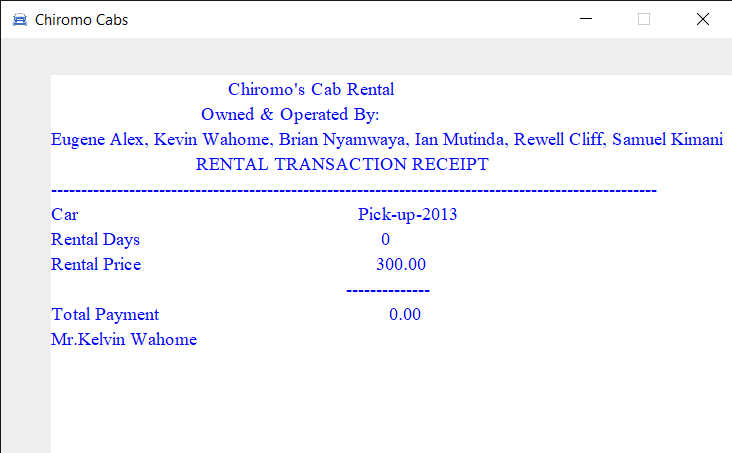
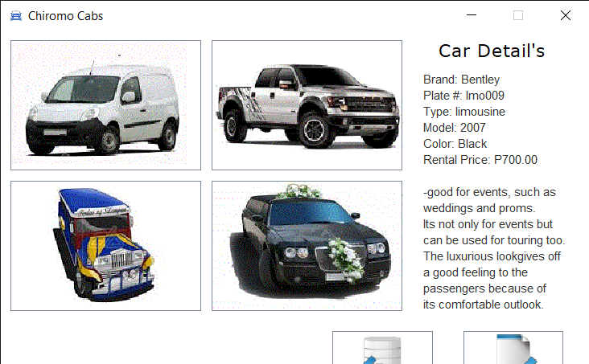

## CHIROMO CABS RENTAL MANAGEMENT SYSTEM

  This application is a car rental company that rents cars within Nairobi. Customers fills in their details in the company's  system. When renting the car, customers fills in the details and chooses a car of his/her preferences.The customer will get a receipt which to provide on the front desk of the company , and be given the car keys and details of the contract.
  
# Installation of the program
 1. Download the zip file from this repository:
  [zip file](https://github.com/Wahomethegeek/ChiromoCabs.git)
2. Extract the files of the projects files in your IDE.

# Usage
This project is competed using intellij IDEA.

Build and run the java class 'Rental' in the source code.

# Features

The aim of this design is to design a user-friendly Car Rental Management System using Java,Java.awt library for the Graphical User Interfaces 
and Java.swing package which provides the java swing API  such as JButton, JTextField and JTextareas.

For each vehicle the customer picks , it gives the details of all features of the vehicle and the charges of each.

Here you can just enter the date from which  you want to rent upto a certain date.

# Screenshots

# Contribution
This is an open-source project.

# Developers
This project was developed as a semester project in the university-Object Oriented Programming with Java
